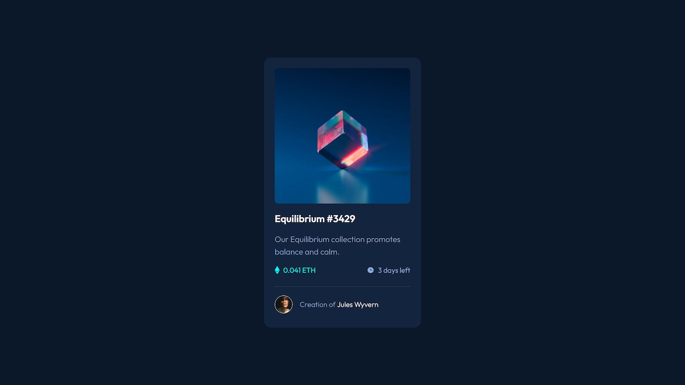

# Frontend Mentor - NFT preview card component solution

This is a solution to the [NFT preview card component challenge on Frontend Mentor](https://www.frontendmentor.io/challenges/nft-preview-card-component-SbdUL_w0U). Frontend Mentor challenges help you improve your coding skills by building realistic projects. 

## Table of contents

- [Overview](#overview)
  - [The challenge](#the-challenge)
  - [Screenshot](#screenshot)
  - [Links](#links)
- [My process](#my-process)
  - [Built with](#built-with)
- [Author](#author)

## Overview

### The challenge

Users should be able to:

- View the optimal layout depending on their device's screen size
- See hover states for interactive elements

### Screenshot

### Links

- Solution URL: [Github Repo](https://github.com/devmor-j/fm-qr-code-component)
- Live Site URL: [Github Pages](https://devmor-j.github.io/fm-qr-code-component/)

## My process

I Tried vanilla CSS first but after a while number of class names got out of control so I thought maybe this project should be done using Tailwind CSS. Turned out this was a great decision... Thanks Tailwind :)

### Built with

- Semantic HTML5 markup
- div-less structure (no extra useless div tags)
- [TailwindCSS](https://tailwindcss.com/) - Main framework for CSS styling
- Mobile-first workflow

## Author

- Frontend Mentor - [@devmor-j](https://www.frontendmentor.io/profile/devmor-j)
